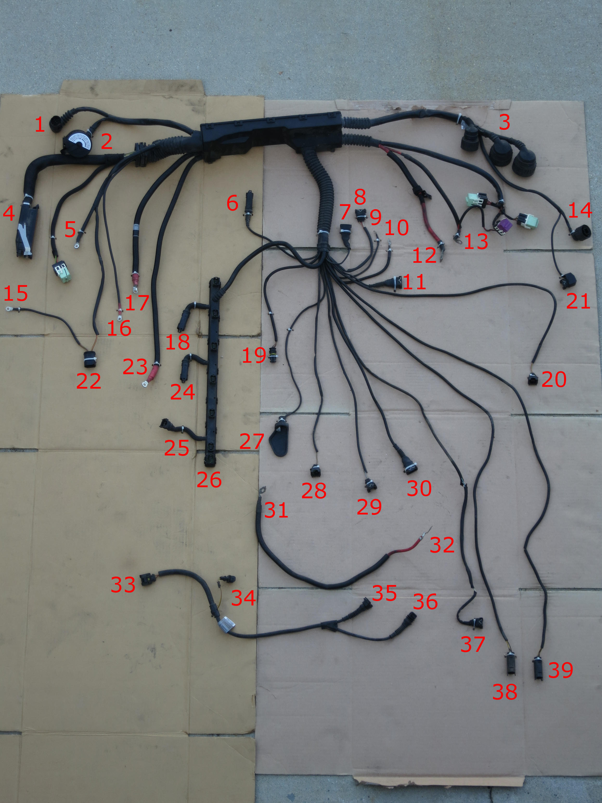

# m52 Wiring Table

| pin # | Connector Designation | Colors | Designation |
| --- | --- | --- | --- |
| 1 | Round Twist | n/a | Ignition Coil Rail |
| 2 | Large Round Twist | n/a | Diagnostic Port |
| 3 | Triple Round Twist | n/a | Fuse & Relay Box |
| 4 | Long Connector | n/a | DME Connector |
| 5 | Double Wire Terminal (In housing/shrink wrap) | BRN - BRN/ORG | Ground G103: Right Front Strut Tower |
| 6 | Round 4-pin Plug | n/a | Knock Sensors |
| 7 | Rectangular 3-pin | n/a | Crank Position, or sub-harness #34 |
| 8 | Rectangular 3-pin | n/a | Idle Control Valve |
| 9 | Single Wire Terminal | n/a | ?? Starter ?? |
| 10 | Single Wire Terminal | n/a | ?? Starter ?? |
| 11 | Rectangular 3-pin | n/a | Cam Position Sensor |
| 12 | Single Wire Terminal | n/a | ?? Starter ?? |
| 13 | Double Wire, Single Terminal | n/a | Terminal next to triple relays on Fuse & Relay Box |
| 14 | Round Twist 4-pin | n/a | MAF |
| 15 | Single Wire Terminal | BRN | Ground G103: Right front strut tower |
| 16 | Single Wire Terminal | RED | ?? Terminal near SAP ?? |
| 17 | Single Wire Terminal | n/a | ?? Terminal near SAP ?? |
| 18 | Round Plug 4-pin | n/a | Front O2 Sensor |
| 19 | Round 4 Pin Plug | VIO/BRN - BRN/YLW - BRN/GRY | Temperature Sensor (Cylinder Head) |
| 20 | Rectangular 2-pin | RED/WHT - YEL/BLU | Fuel Control Valve (Under car) |
| 21 | Rectangular 2-pin | n/a | PCV Valve | 
| 22 | 2-pin Oval Connector | n/a | Secondary Air Pump |
| 23 | Single Wire Terminal	| n/a | ?? Terminal near SAP ?? |
| 24 | Round Plug 4-pin	| n/a |	Front O2 Sensor |
| 25 | Rectangular 2-pin | n/a | ?? Air Pump Control Valve ?? |
| 26 | Rectangular 2-pin | n/a | Vanos Solenoid (last connector on injector rail) |
| 27 | Single Wire Terminal |	BLU |	Alternator |
| 28 | Rectangular 2-pin (1 wire) |	BRN/GRN |	Oil Pressure Sensor |
| 29 | Rectangular 2-pin |	n/a |	Intake Air Temperature Sensor |
| 30 | Rectangular 3-pin |	n/a | Throttle Position Sensor |
| 31 | Single Wire Terminal |	RED |	Starter to Alternator |
| 32 | Single Wire Terminal |	RED |	Alternator to Starter |
| 33 | Rectangular 3-pin |	BRN - YLW - RED/WHT |	Crank Position Sensor (OBD2 in rear of block) |
| 34 | Rectangular 3-pin (2-wires) |	YLW - BRN |	DME Harness #7 or #11 |
| 35 | Rectangular 2-pin | RED/WHT - VIO/GRN |	VANOS Solenoid |
| 36 | Rectangular 2-pin | RED/WHT - VIO/GRN |	End of fuel injector control rail, #26 |
| 37 | Rectangular 2-pin |	YLW/BLU - GRN/WHT |	Transmission Reverse Switch |
| 38 |	Round Plug 4-pin |	BRN - BLK - RED/WHT - YLW |	Rear O2 Sensor (Under car) |
| 39 | Round Plug 4-pin |	BRN - BLK - RED/WHT - YLW |	Rear O2 Sensor (Under car) |
